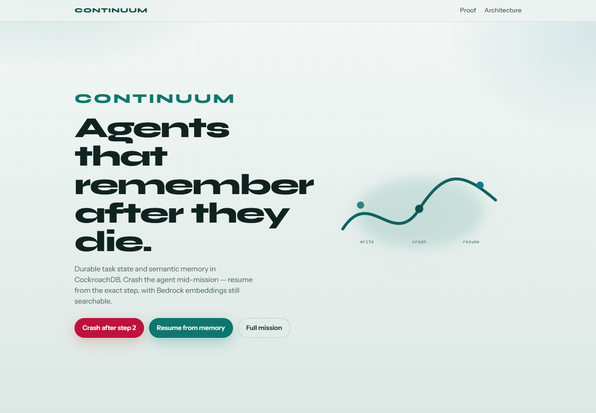
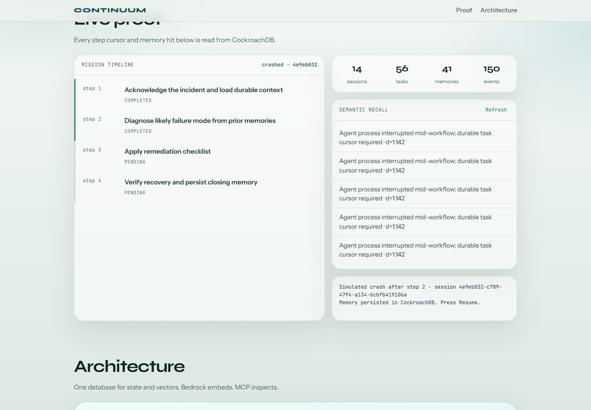
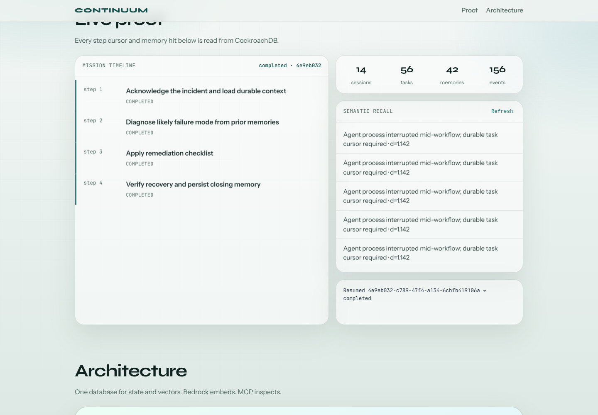
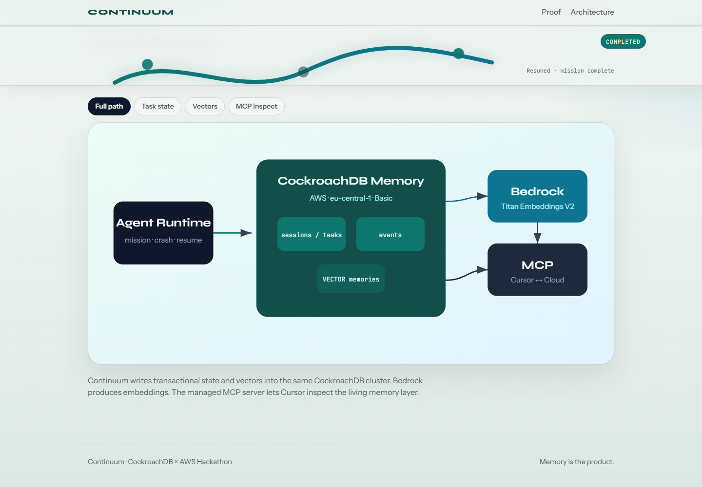

# Continuum

**Agents that remember after they die.**

Continuum is an agentic application whose durable memory lives in **CockroachDB** — task state, event log, and semantic embeddings in one database — with **Amazon Bedrock** Titan embeddings on AWS.

> Built for the CockroachDB × AWS Hackathon — Build with Agentic Memory.



## Why Continuum

Most demo agents keep memory in process RAM. When the process dies, the agent forgets everything and needs a human to re-brief it.

Continuum treats CockroachDB as the system of record:

- **Transactional task cursor** — which step was running when the process died
- **Event log** — auditable trail of what happened
- **Vector memories** — semantic recall of past incidents and decisions in the same database

Jury proof: start a mission → crash after step 2 → resume → remaining steps continue from CockroachDB without re-explaining the goal.



After resume, the unfinished steps complete from durable memory:



## CockroachDB tools used

| Tool | How Continuum uses it |
| --- | --- |
| **Distributed Vector Indexing** | `agent_memories.embedding VECTOR(1024)` + vector distance recall |
| **Cloud Managed MCP Server** | Cursor connects to the cluster via `.cursor/mcp.json` for schema exploration / ops |

## AWS services used

| Service | How Continuum uses it |
| --- | --- |
| **Amazon Bedrock** | Titan Text Embeddings V2 (`amazon.titan-embed-text-v2:0`) via bearer token; local embeddings as offline fallback |
| **CockroachDB Cloud on AWS** | Basic cluster in `eu-central-1` (Frankfurt) |

## Quick start

### Requirements

- Node.js 20+
- CockroachDB Cloud cluster + SQL user
- CA cert at `%APPDATA%\postgresql\root.crt` (Windows)
- `.env` with `DATABASE_URL` (see `.env.example`)
- Optional: `AWS_BEARER_TOKEN_BEDROCK` for real Titan embeddings

### Install & migrate

```bash
npm install
npm run db:ping
npm run db:migrate
```

### Crash / resume demo (CLI)

```bash
npm run demo:kill
npm run demo:resume
```

### Demo UI

```bash
npm run dev:server
```

Open [http://127.0.0.1:8787](http://127.0.0.1:8787)

### Preview screenshots

```bash
npm run capture:preview
```

## Reproduce the submission video

Narrated 1080p demo from the real Continuum UI (not a mockup):

```powershell
npm.cmd run video:draft
```

Writes `artifacts/video/Continuum-hackathon-demo.mp4` plus captions. Narration source: `docs/video/narration.json`. Disclose on YouTube that narration is AI-generated.

## Architecture



```text
Browser demo UI
   │
   ▼
Agent runtime ──writes──▶ agent_sessions / agent_tasks / agent_events
        │
        └──embeds/recalls──▶ agent_memories (VECTOR)  in CockroachDB (AWS eu-central-1)
                                    ▲
Cursor / MCP ───────────────────────┘  (cockroachlabs.cloud/mcp)
Amazon Bedrock Titan Embeddings V2 ──▶ same VECTOR column
```

## Project layout

```text
sql/001_init.sql          Schema
src/db/                   CockroachDB client + migrate
src/memory/               Embeddings + durable store
src/agent/runtime.js      Mission runner with crash simulation
src/demo/crash-resume.js  CLI jury proof
src/server.js             Local demo UI
public/                   Premium demo UI
docs/images/              README screenshots
.cursor/mcp.json.example  CockroachDB Cloud MCP template (copy to mcp.json locally)
```

Copy the MCP template locally (not committed):

```bash
cp .cursor/mcp.json.example .cursor/mcp.json
```

Then set your cluster id in `.cursor/mcp.json`.

## License

[MIT](LICENSE)
