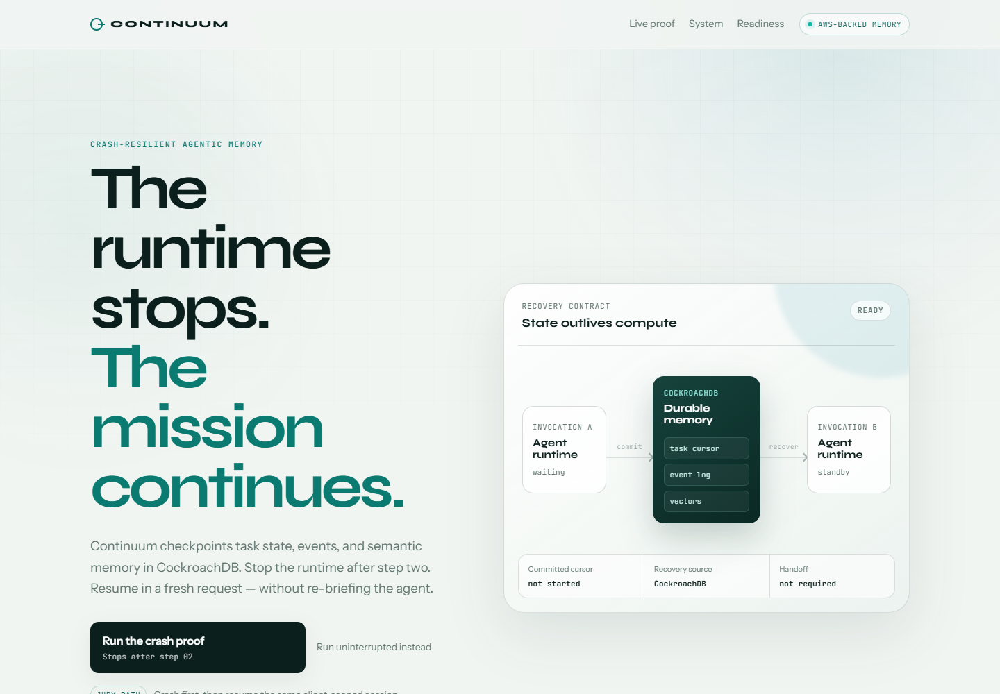
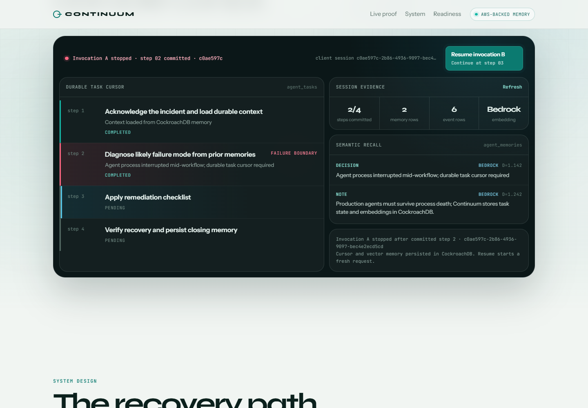
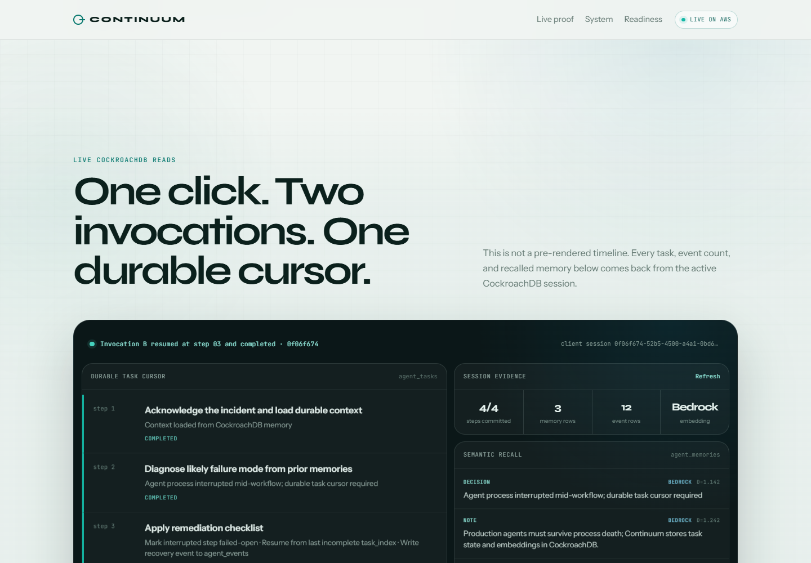
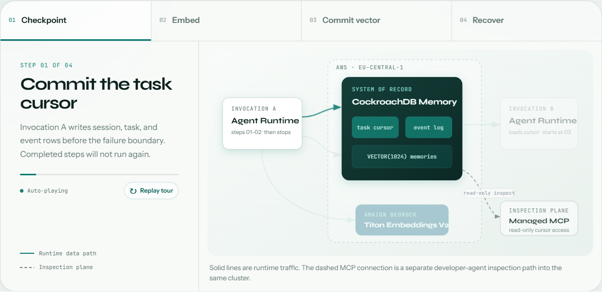

# Continuum

**The runtime stops. The mission continues.**

[](https://github.com/valuecoding/Continuum/actions/workflows/ci.yml)
[](LICENSE)

Continuum is a crash-resilient agent runtime whose task cursor, event trail, and
semantic memory live in CockroachDB. Amazon Bedrock Titan Embeddings V2 turns
memory text into normalized 1024-dimensional vectors; a fresh runtime request
can recover the same mission without a human re-brief.

> Built for the CockroachDB × AWS Hackathon — Build with Agentic Memory.

| | |
| --- | --- |
| **Live demo** | [continuum.vortex-digital.de](https://continuum.vortex-digital.de) |
| **Video** | [youtu.be/7wO_qs9avaI](https://youtu.be/7wO_qs9avaI) |
| **Repository** | [github.com/valuecoding/Continuum](https://github.com/valuecoding/Continuum) |



## The 30-second jury proof

1. Open the [live demo](https://continuum.vortex-digital.de).
2. Select **Run the crash proof**.
3. Invocation A commits step 2, records the failure boundary, and stops.
4. Inspect the task cursor, event count, and vector memories read back from
   CockroachDB.
5. Select **Resume from memory**.
6. Invocation B loads the same client-scoped session, skips completed work, and
   continues at step 3.



After recovery, all four steps belong to the same CockroachDB session:



## Why the memory layer matters

Most agent demos keep workflow position in process memory. If compute
disappears, the agent either starts over or needs a human to explain the
mission again.

Continuum makes CockroachDB the system of record:

- **Ordered task cursor** — pending, in-progress, and completed steps survive
  the runtime boundary.
- **Append-only event trail** — every start, completion, failure, and resume is
  inspectable.
- **Semantic memory** — text, metadata, embedding provider, and `VECTOR(1024)`
  stay beside transactional state.
- **Client-scoped recovery** — a browser can resume only the session identifier
  it created, never another visitor's latest run.

The public proof uses a deterministic simulated runtime stop after committed
step 2 so judges can replay the same boundary on demand. Recovery itself does
not depend on an in-memory session object: the next HTTP request supplies only
the session UUID and reconstructs the mission from CockroachDB.

## Architecture

```text
Browser
  │
  │ POST /api/crash
  ▼
Cloudflare Worker · invocation A
  ├── session / tasks / events ─────────────▶ CockroachDB
  ├── memory text ──────────────────────────▶ Amazon Bedrock
  │                                              │
  └── content + metadata + VECTOR(1024) ◀────────┘
                    │
              deterministic stop
                    │
Browser stores only the returned session UUID
                    │
  │ POST /api/resume + X-Continuum-Session
  ▼
Cloudflare Worker · invocation B
  └── reads cursor + recalls memory ─────────▶ CockroachDB
      skips steps 1–2 and continues at step 3

Cursor agent ── Managed MCP Server ─ ─ ─ ─ ─▶ same CockroachDB cluster
             separate read-only inspection plane
```



The runtime — not CockroachDB — orchestrates the Bedrock request. Managed MCP
is deliberately shown outside the production data path because it is used by
the developer agent to inspect the live cluster.

## Hackathon integrations

### CockroachDB Distributed Vector Indexing

`agent_memories.embedding` is a `VECTOR(1024)` column. Semantic recall orders
memories by vector distance while task state and vector memory remain in one
database. The migration attempts to create the distributed vector index and
falls back safely on clusters where that feature is unavailable.

### CockroachDB Cloud Managed MCP Server

Cursor connects to the live cluster through the managed MCP endpoint for schema
inspection and database operations. This is a developer-agent inspection plane,
not a fake runtime hop. Copy `.cursor/mcp.json.example` to the ignored local
`.cursor/mcp.json` and insert the cluster identifier from CockroachDB Cloud.

### Amazon Bedrock

The runtime calls `amazon.titan-embed-text-v2:0` in `eu-central-1`. Each memory
records `embed_provider` in its metadata, so the UI exposes whether a vector
came from Bedrock or the deterministic offline fallback.

### CockroachDB Cloud on AWS

The managed CockroachDB cluster runs in AWS `eu-central-1`. The public
Cloudflare Worker reaches it through Hyperdrive with query caching disabled for
read-after-write consistency in the crash/resume proof.

## Quick start

### Requirements

- Node.js 20 or newer
- CockroachDB Cloud cluster and SQL user
- CockroachDB root CA at `%APPDATA%\postgresql\root.crt` on Windows
- `.env` based on `.env.example`
- optional Bedrock bearer token or AWS credentials
- Google Chrome for the browser test and preview capture
- Python 3 and FFmpeg 8 for narrated video assets only

### Install and migrate

```bash
npm install
npm run db:ping
npm run db:migrate
```

### Local UI

```bash
npm run dev:server
```

Open [http://127.0.0.1:8787](http://127.0.0.1:8787).

### CLI proof

```bash
npm run demo:kill
npm run demo:resume
```

### Verification

```bash
npm test
npm run test:ui
```

The unit suite verifies UUID isolation and deterministic normalized fallback
embeddings. The real-Chrome suite verifies the complete crash/resume UI at
desktop and mobile widths, the `X-Continuum-Session` handoff, responsive
overflow, provider evidence, and keyboard-operable architecture tabs.

With live credentials configured, verify the actual production vector index and
embedding-provider evidence without creating a new mission:

```bash
npm run db:evidence
```

### Deploy

Production assets and APIs run in a Cloudflare Worker with Hyperdrive:

```bash
npx wrangler deploy
```

Configuration lives in `wrangler.toml`. Secrets such as
`AWS_BEARER_TOKEN_BEDROCK` are set through Wrangler and are never committed.
The Worker adds HSTS, CSP, anti-framing, MIME-sniffing, referrer, and permissions
security headers. Public write actions are limited per Cloudflare client,
status reads use a separate higher limit, explicit cross-site API requests are
rejected, and internal DB/AWS errors are replaced with a generic public error
plus a request ID. The `workers.dev` route and version preview URLs are disabled;
production is served only from the custom domain.

The account, Hyperdrive, and rate-limit namespace IDs in `wrangler.toml` are
resource identifiers, not credentials. They cannot authorize API or database
access. Actual CockroachDB and Bedrock credentials remain in ignored local
files or Cloudflare secret bindings.

## Project layout

```text
sql/001_init.sql          CockroachDB tables and vector index definition
src/agent/runtime.js      Checkpointed four-step mission runtime
src/memory/               Embedding provider and durable memory store
src/db/                   CockroachDB / Hyperdrive client and migration
src/http/session.js       Strict client-session UUID boundary
src/server.js             Local UI and API server
src/cf-worker.js          Production Worker, Hyperdrive, and security headers
public/                   Submission website and interactive architecture
test/                     Unit and real-browser recovery tests
scripts/                  Screenshot and narrated-video pipelines
```

## Reproduce submission assets

```bash
npm run capture:preview
```

This writes the real UI states to `docs/images/`.

For the narrated 1080p video:

```powershell
npm.cmd run video:draft
```

The output is written below `artifacts/video/`. Narration source is versioned in
`docs/video/narration.json`; public uploads should disclose AI-generated
narration.

Copy-ready Devpost text and the final registration checklist live in
[`docs/SUBMISSION.md`](docs/SUBMISSION.md).

## License

[MIT](LICENSE)
